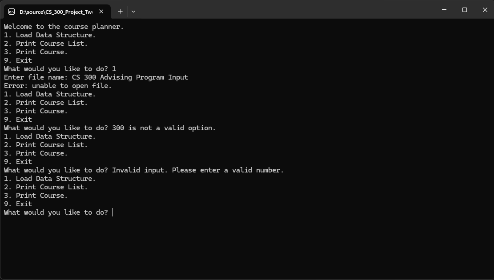
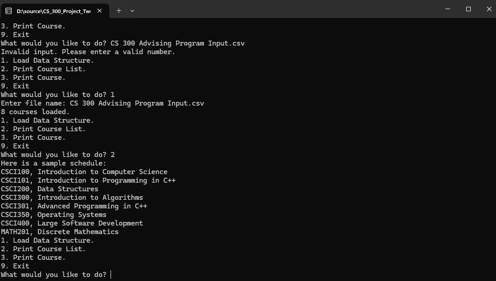
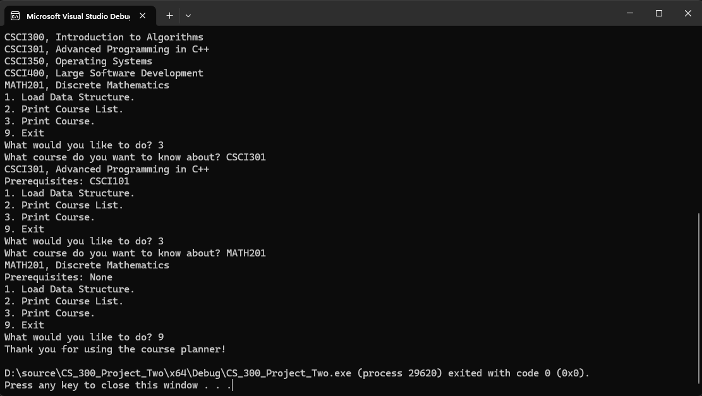

# CS 300 - Data Structures and Algorithms

## Reflection

During this course, I focused on identifying the most effective way to store, organize, and retrieve course data for an
advising assistance program. The primary requirements were to print a complete list of courses in alphanumeric order and
allow users to search for a specific course and view its details, including prerequisites. While these tasks appear
straightforward, the challenge was selecting and implementing the appropriate data structure to support both efficient
searching and ordered output.

To address this, I explored multiple data structures, including a vector, a hash table, and a binary search tree. This
process reinforced how data structures directly impact performance, scalability, and overall program design. For
example, vectors are simple to implement but require sorting and linear searches, which become inefficient as data
grows. Hash tables provide fast lookups but do not maintain order. The binary search tree proved to be the most
effective solution, offering efficient search performance while naturally supporting sorted output through in-order
traversal.

Throughout the projects, I encountered several challenges. One of the main obstacles was handling file input and
validating data, especially when dealing with empty values or improperly formatted lines. Another challenge was
implementing recursive logic in the binary search tree while maintaining structural integrity. I addressed these issues
by breaking problems into smaller steps, testing incrementally, and validating outputs through the menu-driven
interface. This iterative approach made debugging more manageable and improved overall reliability.

This experience strengthened my approach to software design by emphasizing the importance of planning before
implementation. Writing pseudocode for each data structure helped clarify the logic and trade-offs early, which made the
coding phase more efficient. It also reinforced that selecting the right data structure is just as important as writing
correct code.

Additionally, this project improved how I write maintainable and readable code. I focused on modular design, clear
naming conventions, and separating concerns such as file parsing, validation, and data structure operations. These
practices made the program easier to understand, test, and extend. Overall, this work helped me develop a more
structured and intentional approach to problem-solving and program design.

# CS 300 Project One - ABCU Pseudocode

[View PDF](CS%20300%20ABCU%20Project%20One.pdf) | [Download DOCX](CS%20300%20ABCU%20Project%20One.docx)

# CS 300 Project Two - ABCU Advising Assistance Program

## Overview

This project implements a command-line advising assistance program
for ABC University (ABCU). The application allows academic advisors
to load course data, view a sorted list of courses, and retrieve
detailed information about individual courses and their prerequisites.

The program is built using a **Binary Search Tree (BST)**,
which was selected based on prior analysis for its balance
of efficient searching and natural in-order sorting.

---

## Technologies Used

- C++

- Standard Template Library (STL)

- File I/O (ifstream)

- Object-Oriented Programming (OOP)

---

## Features

- Load course data from a CSV file
- Store course data in a Binary Search Tree
- Print all courses in alphanumeric order
- Search for a specific course and display its details
- Validate user input and handle errors gracefully

---

## Menu Options

When the program runs, users are presented with the following menu:

```
1. Load Data Structure
2. Print Course List
3. Print Course
9. Exit
```

### Option 1: Load Data Structure

Prompts the user for a file name and loads course data into the BST.

### Option 2: Print Course List

Displays all courses in alphanumeric order using in-order traversal of the BST.

### Option 3: Print Course

Prompts the user for a course number and displays the course title and prerequisites.

### Option 9: Exit

Terminates the program.

---

## Example Output

```
Welcome to the course planner.
1. Load Data Structure.
2. Print Course List.
3. Print Course.
9. Exit
What would you like to do? 2
No courses loaded.
```

<details>
    <summary>Console Program Screenshots</summary>





</details>

---

---

## How to Run

1. Run the program from your IDE or terminal.

2. Select option **1** to load the data.

3. Enter the provided CSV file name: 'CS 300 Advising Program Input.csv'

4. Use the menu options to explore the program:
    - Option 2: Print all courses
    - Option 3: Search for a course

> Note: Ensure `CS 300 Advising Program Input.csv` is located in the same directory as the program.

---

## Data Structure Choice

A Binary Search Tree was used because:

- It allows efficient search operations (average O(log n))
- It supports in-order traversal for naturally sorted output
- It meets both project requirements without additional sorting steps

---

## Final Status

- All core functionality implemented
- File loading and validation complete
- BST insertion and traversal working correctly
- Course lookup and prerequisite display implemented
- Input validation and error handling included

---

## Author

Joshua Sevy